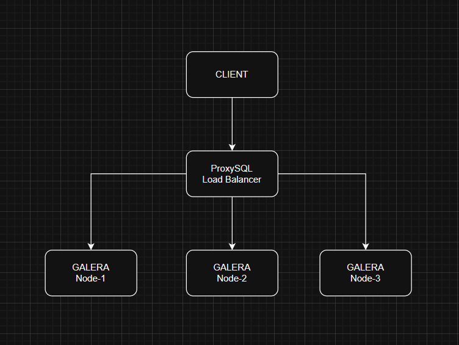

# MariaDB Galera Cluster with ProxySQL on Docker

This project demonstrates a **high-availability MariaDB Galera Cluster** managed by **ProxySQL** using Docker. It features a **multi-master setup** for seamless scaling and failover, with ProxySQL intelligently routing traffic to healthy nodes.

---

## Topology



- **Galera Cluster**: 3 nodes for synchronous multi-master replication.
- **ProxySQL**: Load balancer and query router for high availability and performance.

---

## Getting Started

Follow these steps to launch the cluster environment:

### 1. Clone this repository

```bash
git clone https://github.com/Rullabcde/proxysql-galera.git
```

### 2. Start the containers

```bash
docker compose up -d
```

This command will start all MariaDB Galera nodes and the ProxySQL instance.

### 3. Test the Cluster

```bash
./script/test-cluster
```

This script inserts data via ProxySQL and verifies replication across all Galera nodes.

---
